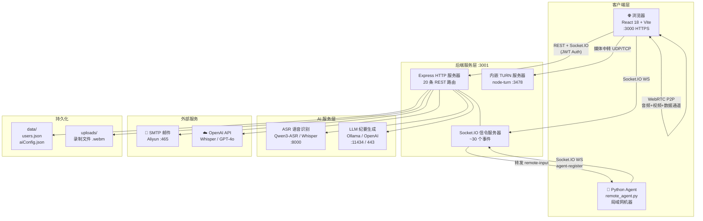
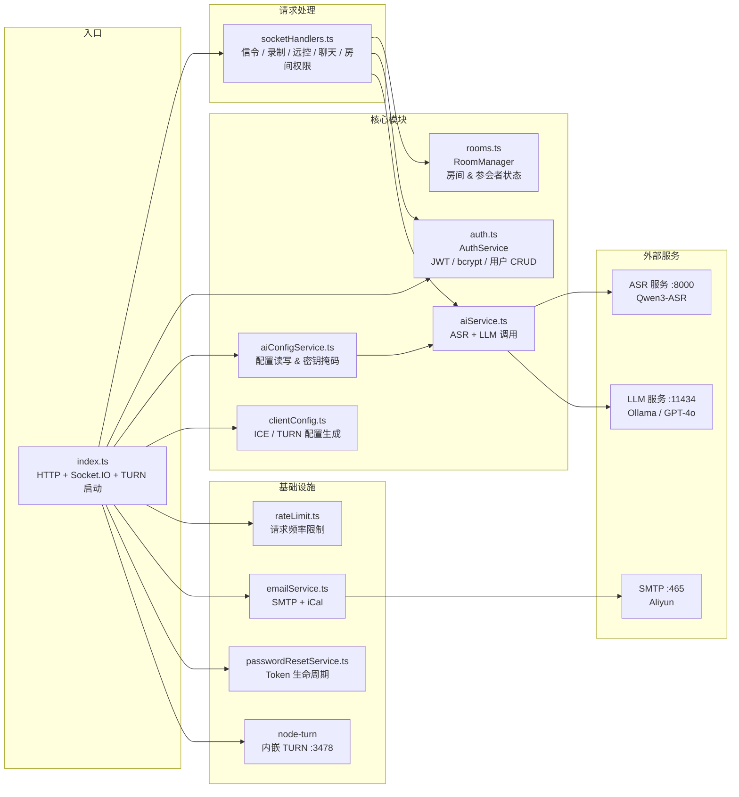
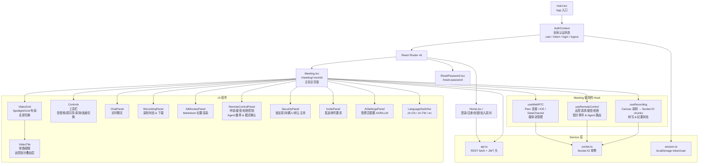
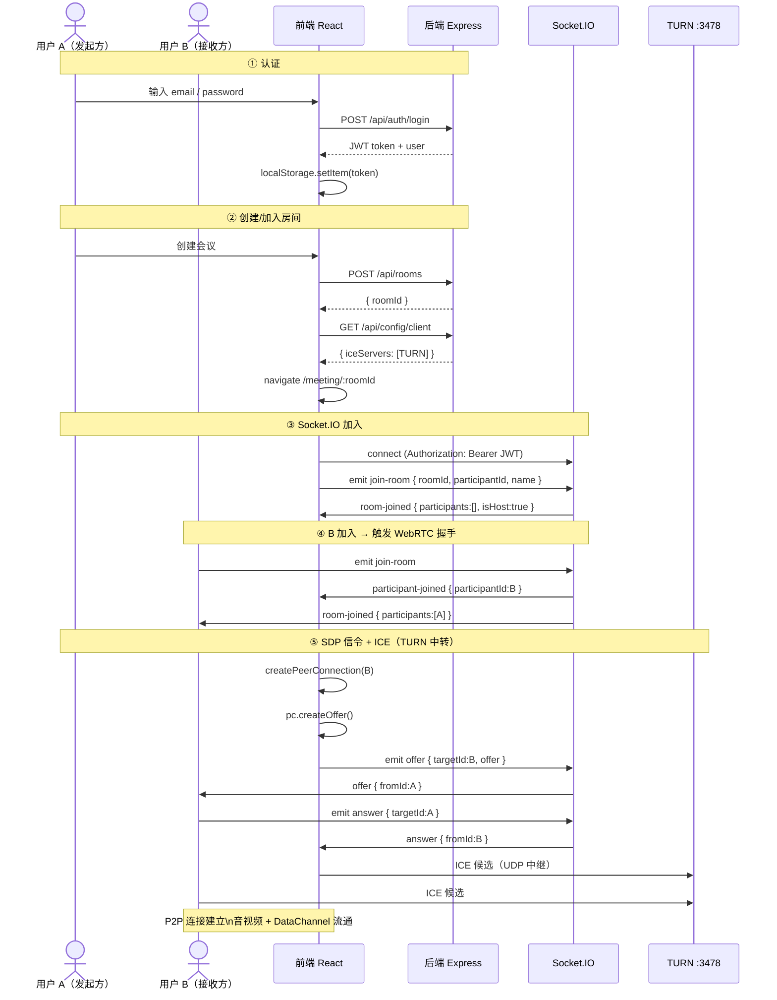
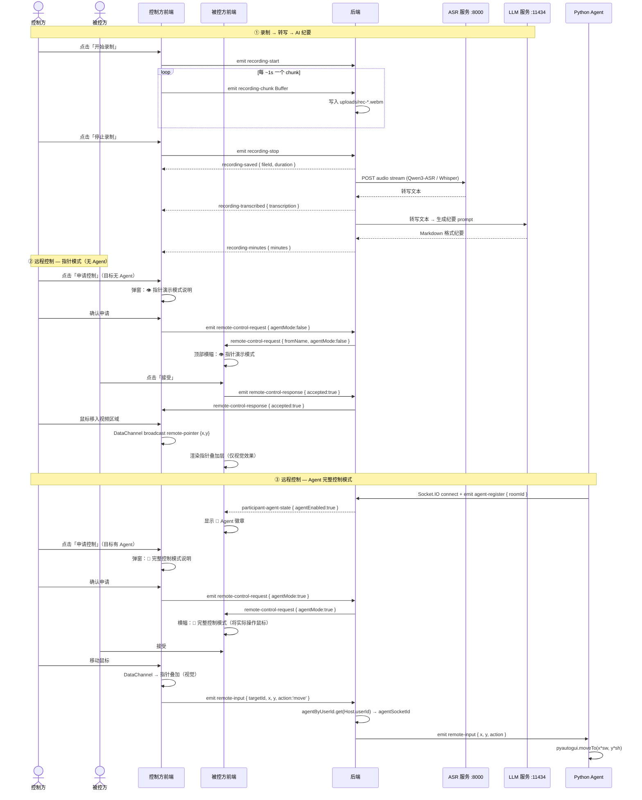
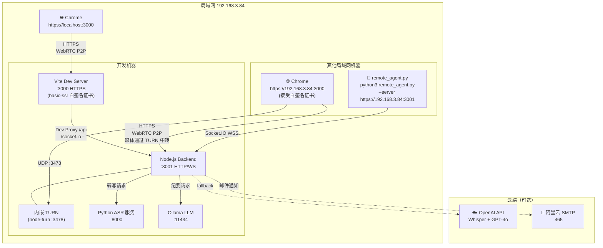
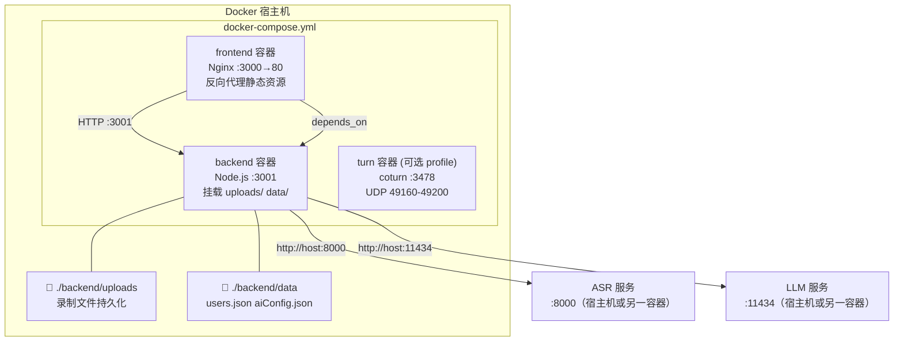

# AiMeeting 系统架构文档

本文档描述 AiMeeting 视频会议系统的完整架构，包含系统总览、模块关系、数据流和部署拓扑。所有图表使用 Mermaid 内嵌格式，可在 GitHub / GitLab / Obsidian 等平台直接渲染。

---

## 目录

1. [系统总览](#1-系统总览)
2. [目录结构与模块职责](#2-目录结构与模块职责)
3. [后端模块关系图](#3-后端模块关系图)
4. [前端组件树](#4-前端组件树)
5. [端到端数据流](#5-端到端数据流)
6. [Socket.IO 事件总览](#6-socketio-事件总览)
7. [部署拓扑图](#7-部署拓扑图)

---

## 1. 系统总览

AiMeeting 是一个基于浏览器的实时视频会议系统，无需插件，支持 P2P/TURN 媒体中转、录制转写、AI 纪要和远程控制两种模式。



---

## 2. 目录结构与模块职责

```
aimeeting/
├── agent/                        # Python 远程控制代理
│   ├── remote_agent.py           # Socket.IO 客户端，通过 pyautogui 执行真实鼠标操作
│   └── requirements.txt          # python-socketio, pyautogui, requests
│
├── backend/                      # Node.js + TypeScript 后端
│   ├── src/
│   │   ├── index.ts              # Express 服务器入口、路由注册、node-turn 启动
│   │   ├── socketHandlers.ts     # 全部 Socket.IO 事件处理（信令/录制/远控/聊天）
│   │   ├── rooms.ts              # 内存房间管理（创建/加入/离开/主持人选举）
│   │   ├── auth.ts               # JWT 签发验证、bcrypt 密码、用户 CRUD
│   │   ├── aiService.ts          # ASR 调用（Qwen3 / Whisper）+ LLM 纪要生成
│   │   ├── aiConfigService.ts    # AI 配置读写（aiConfig.json）+ 密钥掩码
│   │   ├── clientConfig.ts       # ICE/TURN 配置生成（返回给前端）
│   │   ├── emailService.ts       # SMTP 邮件 + iCal 日历附件
│   │   ├── passwordResetService.ts # 密码重置 Token 生成/验证
│   │   └── rateLimit.ts          # Express 请求频率限制中间件
│   ├── data/                     # 持久化 JSON 文件（随容器卷挂载保留）
│   ├── uploads/                  # 会议录制 .webm 文件
│   ├── .env                      # 环境变量（见第 7 节）
│   └── Dockerfile
│
├── frontend/                     # React 18 + TypeScript + Vite
│   ├── src/
│   │   ├── pages/                # 三个页面
│   │   ├── components/           # 11 个 UI 组件
│   │   ├── hooks/                # 3 个自定义 Hook
│   │   ├── services/             # REST / Socket.IO / localStorage 封装
│   │   ├── context/              # AuthContext 全局认证状态
│   │   ├── i18n/locales/         # zh-CN / zh-TW / en 翻译文件
│   │   └── types/                # TypeScript 类型定义
│   ├── vite.config.ts            # Dev 代理 + HTTPS（basic-ssl）
│   └── Dockerfile                # Nginx 反向代理（生产）
│
└── docker-compose.yml            # 多服务编排（backend / frontend / turn）
```

---

## 3. 后端模块关系图



---

## 4. 前端组件树



---

## 5. 端到端数据流

### 图 A：认证 → 加入房间 → WebRTC P2P 建立



### 图 B：录制 → AI 处理；以及双模式远程控制



---

## 6. Socket.IO 事件总览

### 房间管理

| 事件名 | 方向 | 主要 Payload | 说明 |
|--------|------|-------------|------|
| `join-room` | C→S | `{ roomId, participantId, name, passcode? }` | 加入房间 |
| `room-joined` | S→C | `{ roomId, participants, isHost, hostId, room }` | 发送给新加入者 |
| `participant-joined` | S→C | `{ participantId, name, isHost, agentEnabled }` | 广播给已有成员 |
| `participant-left` | S→C | `{ participantId }` | 成员离开 |
| `room-error` | S→C | `{ message }` | 房间访问错误 |
| `host-changed` | S→C | `{ participantId }` | 主持人变更 |
| `room-locked-state` | S→C | `{ isLocked }` | 房间锁定状态 |
| `participant-kicked` | S→C | `{ roomId }` | 被踢出房间 |
| `toggle-room-lock` | C→S | `{ roomId, locked }` | 主持人锁定/解锁 |
| `kick-participant` | C→S | `{ participantId }` | 主持人移除参会者 |
| `transfer-host` | C→S | `{ participantId }` | 移交主持人权限 |

### WebRTC 信令

| 事件名 | 方向 | 主要 Payload | 说明 |
|--------|------|-------------|------|
| `offer` | C↔S↔C | `{ targetId, fromId, offer }` | SDP Offer 中继 |
| `answer` | C↔S↔C | `{ targetId, fromId, answer }` | SDP Answer 中继 |
| `ice-candidate` | C↔S↔C | `{ targetId, fromId, candidate }` | ICE 候选中继 |

### 远程控制

| 事件名 | 方向 | 主要 Payload | 说明 |
|--------|------|-------------|------|
| `remote-control-request` | C→S→C | `{ targetId, fromId, fromName, agentMode }` | 申请控制（含模式标志） |
| `remote-control-response` | C→S→C | `{ targetId, fromId, accepted }` | 接受/拒绝 |
| `remote-control-end` | C→S→C | `{ targetId, fromId }` | 结束控制 |
| `agent-register` | Agent→S | `{ roomId }` | Python Agent 注册 |
| `remote-input` | C→S→Agent | `{ targetId, x, y, action }` | 鼠标事件路由到 Agent |
| `participant-agent-state` | S→C | `{ participantId, agentEnabled }` | Agent 上/下线广播 |

### 录制 & AI

| 事件名 | 方向 | 主要 Payload | 说明 |
|--------|------|-------------|------|
| `recording-start` | C→S | —  | 开始录制 |
| `recording-chunk` | C→S | `Buffer` | WebM 数据块 |
| `recording-stop` | C→S | — | 停止录制，触发 AI 流水线 |
| `recording-saved` | S→C | `{ fileId, duration }` | 文件已保存 |
| `recording-transcribed` | S→C | `{ transcription }` | ASR 转写完成 |
| `recording-minutes` | S→C | `{ minutes }` | AI 纪要生成完成 |
| `recording-error` | S→C | `{ message }` | ASR 错误 |
| `recording-minutes-error` | S→C | `{ message }` | 纪要生成错误 |

### 聊天 & DataChannel（P2P）

| 事件名 | 方向 | 主要 Payload | 说明 |
|--------|------|-------------|------|
| `chat-message` | C↔S↔C | `{ fromId, fromName, message, timestamp }` | 文字聊天 |
| `remote-pointer` *(DC)* | P2P DataChannel | `{ participantId, targetId, x, y, clicking }` | 指针位置广播 |
| `remote-click` *(DC)* | P2P DataChannel | `{ participantId, targetId, x, y, clicking }` | 点击事件广播 |
| `media-state` *(DC)* | P2P DataChannel | `{ isAudioEnabled, isVideoEnabled }` | 音视频状态同步 |
| `screen-share-state` *(DC)* | P2P DataChannel | `{ isSharing }` | 屏幕共享状态同步 |

---

## 7. 部署拓扑图

### 本地开发模式



### 生产 Docker Compose 模式



### 环境变量速查

| 变量 | 用途 | 示例值 |
|------|------|--------|
| `PORT` | 后端监听端口 | `3001` |
| `APP_BASE_URL` | 前端 URL（用于 TURN 配置 & 邮件链接） | `https://192.168.3.84:3000` |
| `JWT_SECRET` | JWT 签名密钥 | 随机 32+ 位十六进制 |
| `ADMIN_EMAIL` | 管理员账号 | `admin@example.com` |
| `STUN_URLS` | STUN 服务器（空=跳过 Google STUN） | `` （留空） |
| `INTERNAL_TURN_PORT` | 内嵌 TURN 端口 | `3478` |
| `INTERNAL_TURN_USER / PASS` | 内嵌 TURN 凭据 | `aimeeting` / `aimeeting2024` |
| `ASR_BASE_URL` | ASR 服务地址 | `http://localhost:8000` |
| `ASR_MODEL` | ASR 模型名称 | `Qwen/Qwen3-ASR-1.7B` |
| `LLM_BASE_URL` | LLM 服务地址 | `http://localhost:11434/v1` |
| `LLM_MODEL` | LLM 模型名称 | `qwen3` |
| `SMTP_HOST / PORT / USER / PASS` | 邮件服务配置 | `smtpdm.aliyun.com` / `465` |
| `HF_TOKEN` | HuggingFace Token（下载受限模型） | `hf_...` |

---

## 快速启动

### 开发模式
```bash
# 安装依赖
npm install

# 启动（前端 :3000 + 后端 :3001 + 内嵌 TURN :3478）
npm run dev
```

### Python Agent（被控机器上运行）
```bash
cd agent
pip3 install -r requirements.txt
python3 remote_agent.py \
  --server https://192.168.3.84:3001 \
  --room  <房间ID> \
  --email user@example.com \
  --password yourpassword
```

### 生产容器
```bash
docker compose up -d
# 启用外部 TURN（可选）
docker compose --profile turn up -d
```

---

*文档生成于 2026-04-06，基于 AiMeeting 当前代码版本。*
